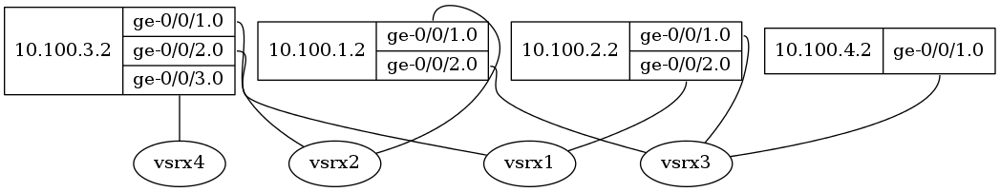

# Exercise 1 - Connect Ansible to LAB
The goal of this exercise is to verify Ansible can connect to the [LAB](../LAB) and complete a task.  I chose to gather facts as the the initial proof of life for Ansible to my LAB topology.  I then used an existing Ansible Example to generate a Network Graph from LLDP neighbor relationships.

## Gather Facts
Run an initial ansible playbook to gather facts about the hosts.

```
ansible-playbook -i inventory.inv facts.pb.yaml
Username: ansible
password:

PLAY [Get facts] **************************************************************************************************************************************************************

TASK [Get junos facts] ********************************************************************************************************************************************************
ok: [10.100.2.2]
ok: [10.100.1.2]
ok: [10.100.3.2]
ok: [10.100.4.2]

TASK [Print facts] ************************************************************************************************************************************************************
...
Output omitted for berevity.  
...
PLAY RECAP ********************************************************************************************************************************************************************
10.100.1.2                 : ok=2    changed=0    unreachable=0    failed=0
10.100.2.2                 : ok=2    changed=0    unreachable=0    failed=0
10.100.3.2                 : ok=2    changed=0    unreachable=0    failed=0
10.100.4.2                 : ok=2    changed=0    unreachable=0    failed=0

```
Output omitted for berevity.  See [gather-facts.txt](gather-facts.txt)

## Generate Network Graph from LLDP
I imported the [Ansible Example](https://github.com/ipspace/ansible-examples) [LLDP-to-Graph-eznc](https://github.com/ipspace/ansible-examples/tree/master/LLDP-to-Graph-pyeznc) to a sub directory.  I then copied my inventory file to the sub directory.  I had to modify the example command to make it work for my topology. 

Here is my modified command to generate the network graph 
```
ansible-playbook -i inventory.inv LLDP-to-Graph-eznc.yml -u ansible -k
dot -Tpng network.dot > network.png
```
Here is the resulting dot file.
```
graph network {
  "10.100.1.2" [shape=record,
    label="<node>10.100.1.2|{ <ge-0/0/1.0>ge-0/0/1.0|<ge-0/0/2.0>ge-0/0/2.0 }"];
  "10.100.2.2" [shape=record,
    label="<node>10.100.2.2|{ <ge-0/0/1.0>ge-0/0/1.0|<ge-0/0/2.0>ge-0/0/2.0 }"];
  "10.100.3.2" [shape=record,
    label="<node>10.100.3.2|{ <ge-0/0/1.0>ge-0/0/1.0|<ge-0/0/2.0>ge-0/0/2.0|<ge-0/0/3.0>ge-0/0/3.0 }"];
  "10.100.4.2" [shape=record,
    label="<node>10.100.4.2|{ <ge-0/0/1.0>ge-0/0/1.0 }"];
  "10.100.1.2":"ge-0/0/1.0" -- "vsrx2":"";
  "10.100.1.2":"ge-0/0/2.0" -- "vsrx3":"";
  "10.100.2.2":"ge-0/0/1.0" -- "vsrx3":"";
  "10.100.2.2":"ge-0/0/2.0" -- "vsrx1":"";
  "10.100.3.2":"ge-0/0/1.0" -- "vsrx1":"";
  "10.100.3.2":"ge-0/0/2.0" -- "vsrx2":"";
  "10.100.3.2":"ge-0/0/3.0" -- "vsrx4":"";
  "10.100.4.2":"ge-0/0/1.0" -- "vsrx3":"";
}
```
Here is the resulting PNG.

